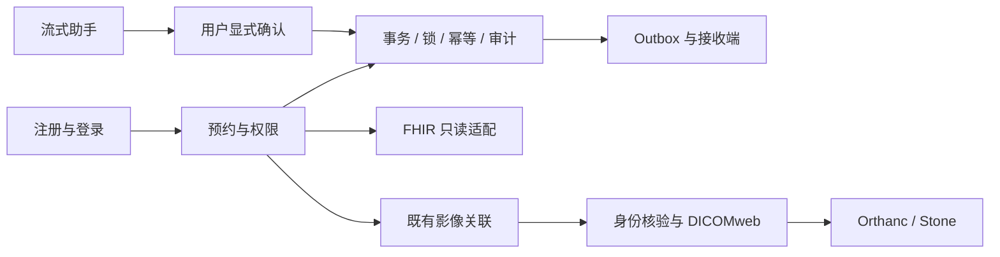

# 文档导读地图

先用项目，再沿一条业务链读代码。日常只需三个入口：[项目首页](../README.md)、[运行手册](runbook.md)、[完成度与验收](acceptance.md#current-status)。本页负责导航，规则和执行证据放在各自的主文档中。

## 按你现在要做的事选择

| 现在的问题 | 先读 | 然后做什么 |
|---|---|---|
| 功能到底完成了吗？还有什么没做？ | [状态与边界](acceptance.md#current-status) | 区分已实现、历史执行、本次复核、生产化未覆盖项 |
| 十分钟内跑起来 | [运行手册](runbook.md) | 启动 → 注册 → 创建预约；工作人员完成核对和确认 |
| 数据库有哪些表、字段、索引，AI 数据存哪里？ | [数据库设计与数据字典](database-design.md) | 查看13张业务表、完整关系图、事务边界与AI内存状态 |
| 哪个账号能操作什么？ | [账号与生命周期](accounts-and-lifecycle.md) | 按权限表切换角色，Admin 只负责同步管理等已授权操作 |
| 创建/改期为何不会抢到同一时段？ | [架构与时序](architecture.md) | 对照 SchedulingService 的锁、事务、唯一约束和 Version |
| 请求失败该刷新还是重试？ | [API 契约](api.md) | 区分资源冲突、旧版本、同 Key 异内容；网络结果未知时重用原 Key |
| 外部服务停机为何预约仍成功？ | [架构](architecture.md) / [Outbox ADR](adr/004-outbox.md) | 看事务提交与 HTTP 发送的边界，再查看 Admin attempts |
| 我会 Java，但看不懂 C# | [统一学习手册](csharp-dotnet-crash-course.md) | 查语法/框架对应，再按[七天代码路线](csharp-dotnet-crash-course.md#reading-route)实践 |
| Docker、环境变量和容器是怎么配合的？ | [Docker 教程](docker-crash-course.md) | 实際版本、服务与命令以 Dockerfile、compose.yaml、运行手册为准 |
| AI 助手怎样保证不越权、不自动下单？ | [Agent 指南](appointment-agent.md) | 看工具归属范围、候选有效性和显式确认；真实模型需要密钥 |
| FHIR 和 DICOM 分别负责什么？ | [FHIR 范围](fhir-r4.md) / [影像学习](imaging/learning-guide.md) | FHIR 表达患者/预约；DICOMweb 访问既有影像；本项目未做跨标准 ImagingStudy 映射 |
| 影像查不到、打不开、服务故障 | [影像运行与排障](imaging/README.md#operations) | 按身份映射 → 角色 → 标准响应 → 代理 → 像素请求排查 |
| 怎样证明功能有效？ | [验收矩阵](acceptance.md#acceptance-matrix) | 找需求 ID → 测试 → 执行条件，不把配置文件当执行结果 |
| 学并发、幂等和 SQL 排障 | [实验任务](../labs/README.md) | 先独立复现，再看[解析与 RCA](../labs/solutions/analysis.md) |
| 升级失败怎么办？ | [升级与恢复记录](acceptance.md#upgrade) | 在隔离库演练真实备份恢复；MySQL 备份不含 Orthanc 像素 |
| 三分钟怎么讲项目？ | [演示与面试](demo-and-interview.md) | 主线与影像各有讲稿、代码追问、边界说明 |
| 当初为什么这样设计？ | [ADR 索引](#decisions) / [原始规格](../SPEC.md) | 查决策理由；历史需求不作为当前功能状态 |

## 功能 → 代码 → 测试地图

所有链接指向仓库中的实际文件。先读入口，再跟业务服务，不必先通读实体和所有迁移。

| 链路 | 后端入口与核心 | 前端 / 外部组件 | 验证入口 |
|---|---|---|---|
| 登录、注册、归属 | [Identity](../backend/Identity.cs)、[AppointmentAccess](../backend/AppointmentAccess.cs) | [Auth](../frontend/src/Auth.tsx) | [AccountLifecycleTests](../tests/AccountLifecycleTests.cs)、[账号 HTTP](../tests/http-accounts.mjs) |
| 创建、改期、任务、确认、完成 | [Endpoints](../backend/Scheduling/Endpoints.cs) → [SchedulingService](../backend/Scheduling/SchedulingService.cs) → [ClinicDb](../backend/ClinicDb.cs) | [Scheduling](../frontend/src/Scheduling.tsx)、[api](../frontend/src/api.ts) | [SchedulingTests](../tests/SchedulingTests.cs)、[生命周期测试](../tests/AccountLifecycleTests.cs) |
| 异步同步、租约、重试 | [Dispatcher / OutboxWorker](../backend/Integration/Dispatcher.cs) | [接收端](../mock-external/server.mjs)、[SyncQueue](../frontend/src/SyncQueue.tsx) | [IntegrationTests](../tests/IntegrationTests.cs)、[持久接收测试](../mock-external/receiver.test.mjs)、[停机测试](../tests/http-integration.mjs) |
| FHIR 读取与错误 | [FhirAdapter](../backend/Fhir/FhirAdapter.cs) | 共享登录 Cookie 与归属边界 | [FhirTests](../tests/FhirTests.cs)、[FHIR HTTP](../tests/http-fhir.mjs) |
| 对话、候选、流式确认 | [Agent 端点](../backend/Agent/Endpoints.cs) → [AppointmentAgent](../backend/Agent/AppointmentAgent.cs)、[PiAgentRuntime](../backend/Agent/PiAgentRuntime.cs)、[AgentModel](../backend/Agent/AgentModel.cs) | [AppointmentAssistant](../frontend/src/AppointmentAssistant.tsx)、[Pi runtime](../agent-runtime/runtime.mjs) | [AgentTests](../tests/AgentTests.cs)、[KimiModelTests](../tests/KimiModelTests.cs)、[运行时测试](../agent-runtime/runtime.test.mjs) |
| 影像查询、关联、查看 | [影像端点](../backend/Imaging/Endpoints.cs) → [ImagingService](../backend/Imaging/ImagingService.cs) → [DicomWebClient](../backend/Imaging/DicomWebClient.cs) | [ImagingPanel](../frontend/src/ImagingPanel.tsx)、[合成数据](../imaging/seed.py)、Orthanc/Stone | [ImagingTests](../tests/ImagingTests.cs)、[真实 HTTP](../tests/http-imaging.mjs)、[故障实验](../tests/http-imaging-outage.mjs) |
| 装配、契约、交付 | [Program](../backend/Program.cs)、[OpenAPI](../backend/ApiDocumentation.cs)、[CI](../.github/workflows/ci.yml) | [Dockerfile](../Dockerfile)、[Compose](../compose.yaml) | [执行手册](runbook.md)、[干净启动证据](evidence/clean-start.md) |

## 推荐阅读节奏

- **30 分钟看全貌**：项目首页 → 账号流程 → 架构图 → 完成度；能说明业务状态和同步状态的区别。
- **半天读主线**：实际创建一次预约，沿上表读 Endpoints → Create/Execute → 数据模型 → 测试；解释一次冲突与一次回滚。
- **七天迁移学习**：按 C# 手册末尾路线完成每天产物。Completed 已实现，应复盘后另选小规则修改，不能把已有功能当自己的独立交付。
- **两周医疗集成补充**：按影像学习指南，先掌握 PatientID/Issuer 和 Study/Series/Instance，再复现真实 HTTP、画布显示与停机恢复。
- **面试前一天**：统一演示文档 → 验收证据 → 代码追问。只讲清已经亲手验证或真正理解的部分。

## 文档分工与决策索引

| 主文档 | 唯一职责 |
|---|---|
| [运行手册](runbook.md) | 启停、开发、验证命令与环境问题 |
| [账号与生命周期](accounts-and-lifecycle.md) | 身份归属、角色、状态转换与 Completed |
| [数据库设计](database-design.md) | 表结构、字段类型、可空性、主外键与索引；各存储边界 |
| [架构](architecture.md) / [API](api.md) | 内部模型与事务 / 对外协议和错误语义 |
| [验收记录](acceptance.md) | 当前完成度、历史测试证据、升级恢复、里程碑摘要 |
| [C# 手册](csharp-dotnet-crash-course.md) / [Docker 教程](docker-crash-course.md) | 技术概念与学习路线；示例不替代当前配置 |
| [Agent](appointment-agent.md) / [运行时](../agent-runtime/README.md) | 功能与信任边界 / 私有进程协议 |
| [影像手册](imaging/README.md) | 组件、合成数据、运行、演示、排障和恢复边界 |
| [影像设计](imaging/design.md) / [学习](imaging/learning-guide.md) / [验证](imaging/verification.md) | 设计与限制 / 标准入门 / 实际执行证据 |
| [演示与面试](demo-and-interview.md) | 主线与医疗集成讲稿、追问、STAR 和英文练习 |
| [实验](../labs/README.md) / [解析](../labs/solutions/analysis.md) | 保留任务与答案分离，解析含 RCA |
| [SPEC](../SPEC.md) / [领域词汇](../CONTEXT.md) | 原始需求及后续范围变更 / 术语定义 |

ADR 按问题选读：[001 平台](adr/001-platform.md)、[002 认证](adr/002-authentication.md)、[003 事务](adr/003-transactions.md)、[004 Outbox](adr/004-outbox.md)、[005 账号与完成](adr/005-account-ownership-and-completion.md)、[006 Pi 运行时](adr/006-pi-agent-runtime.md)、[007 影像集成](adr/007-dicomweb-imaging.md)。ADR 和原始证据保留独立文件，因为它们分别记录不可混淆的决策和执行条件。

## 本次整合后的旧入口去向

| 原文档主题 | 现在的位置 |
|---|---|
| Java 逐文件对照、七天路线 | C# / .NET 服务端速成手册及 reading-route 章节 |
| 独立 Completed 任务 | 账号与预约闭环；明确为已实现 |
| 影像 operations | 影像手册的 operations 章节 |
| 影像 interview | 统一演示与面试的 imaging-interview 章节 |
| 开发进度、升级检查 | 验收文档的 history / upgrade 章节 |
| 旧快照覆盖 RCA | 实验解析的 rca 章节 |

维护时更新对应主文档，并在涉及导航变化时更新此地图。历史测试数保留日期；新增验证结果写明本次实际执行范围。
