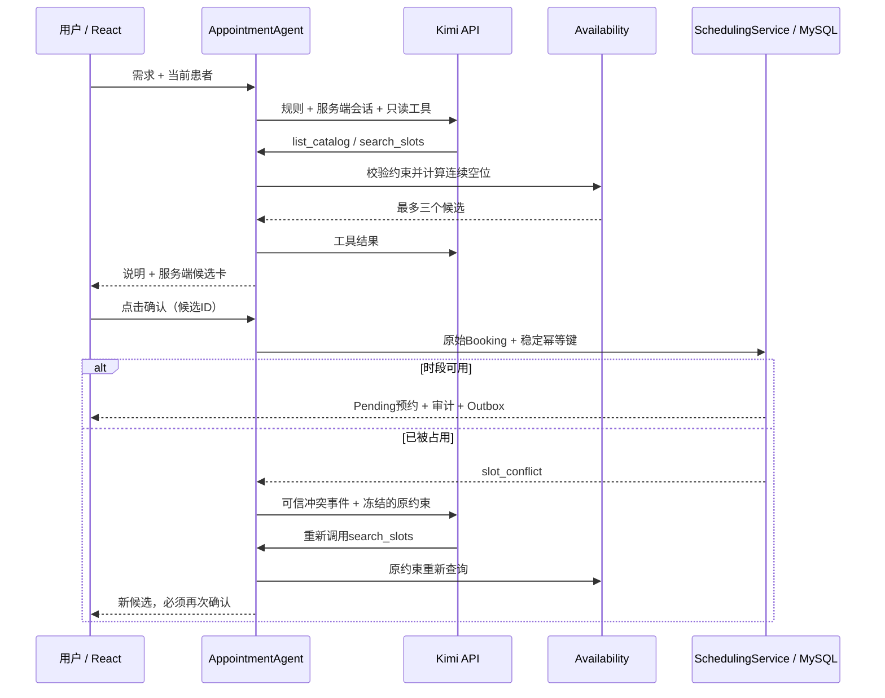

# 预约协调 Agent（Kimi）

第一版服务于作品展示与技术验证：Scheduler 用自然语言提出需求，助手查询并给出最多三个候选，用户点击确认卡后创建 Pending 预约。发生真实资源冲突时，重新查询原约束下的候选，再次等待确认。聊天中的“确认”不会写入预约。

## 启动与配置

在 Moonshot 开放平台创建 API Key，将以下变量保存在本机 `.env`（已被 Git 忽略）。不要把密钥放进聊天、前端变量、截图或提交。

```dotenv
KIMI_API_KEY=你的开放平台密钥
Agent__BaseUrl=https://api.moonshot.cn/v1
Agent__Model=kimi-k2.6
Agent__DemoEnabled=false
```

国际平台账户可使用 `https://api.moonshot.ai/v1`，密钥与账户区域须匹配。只允许这两个官方地址。默认使用 `kimi-k2.6`：本次联调通过账户 `/models` 验证可用，并完成真实工具调用；模型访问权限以自己的账户为准。Kimi 网页订阅与开放平台 API 额度应分别核实。

本机开发：`docker compose up -d --wait`，然后 `./scripts/api.sh` 和 `npm --prefix frontend run dev`。配置改动后重启后端。容器开发：`docker compose --profile full up -d --build --wait` 会传入这些变量。没有密钥时原预约表单仍可用，助手显示未配置。

演示冲突：在 `.env` 设置 `Agent__DemoEnabled=true` 并重启。只有 Development 环境且该开关为 true 时才注册模拟接口。按钮会明确提示它将真实创建占位预约；演示后在预约列表取消该笔预约。Production 环境不会注册该接口。

## 用户流程与范围

- 页面选中的患者可沿用，也可以在助手中选取。仅暴露两名种子虚构患者（DEMO-001/002）。
- 患者、时长、日期范围缺失时追问；未指定资源则查询全部预约资源。日期范围最多31天。
- 上海时区，工作日09:00–17:00；15分钟粒度，单次15–240分钟；候选必须在未来。用户的日期与每日时间窗口代表可用时间。
- 只做新建，不自动完成人工核对，不处理临床适配、节假日、改期、取消和长期偏好。
- 按开始时间、资源编号稳定排序，最多展示3个候选。查询不占位。
- 无空位不擅自放宽条件。工具或模型错误显示停止，不能当成“无空位”。
- 每轮最多8个工具调用；一次冲突恢复最多2次空位查询；模型HTTP超时45秒，整轮90秒。每用户每分钟最多12轮新消息，每会话最多20轮。
- 新指令使旧候选失效。确认响应丢失时仅重试同一候选，不切换候选或自动重新创建。

## 架构与信任边界



`KimiAgentModel` 用 HttpClient 调用兼容 Chat Completions 的 Kimi API，关闭 thinking，保留标准工具调用消息。未引入 Python 服务或额外 Agent SDK。

模型只有 `list_catalog`、`search_slots` 两个工具，没有写工具。每轮搜索前必须查询目录。服务端对“仅预约室A”等明确排他资源短语绑定目录ID，防止模型漏传ResourceId而扩大资源范围；这是有限的短语保护，不是完整的自然语言解析器。候选时间使用带UTC偏移的ISO时间，前端同时接受 `Z` 和 `+00:00`，统一显示上海时间。`Availability` 用真实 SlotClaims 计算连续空位，模型不负责时间算术。后端保存候选的完整 Booking，确认请求只能提交候选 ID，不能替换患者、资源或时间。创建复用 SchedulingService 的锁、事务、幂等、审计和 Outbox。

所有 Agent 接口要求 Scheduler；Cookie/CSRF 沿用现有中间件。Admin 不继承权限。会话绑定当前账号，并串行执行同一会话请求。首次确认后锁定该候选，结果不明时只能使用同一幂等键核实；成功后阻止同会话其他候选写入。外部错误正文、密钥及模型思考不进入用户执行记录。

第一版会话仅存于单进程内存，最多128个，固定30分钟过期；重启或过期后不恢复聊天。此时先从预约列表核实已提交的结果，再开启新会话。数据库内已提交预约、审计和幂等记录仍保留。多实例部署前需将会话、候选及确认状态持久化，而不是直接扩容。模型解析自然语言仍可能出错，因此结构化确认卡和场景评估都是必要边界。

## API

| 接口 | 用途 |
|---|---|
| `GET /api/agent/config` | 配置是否存在、模型名、时区、演示开关；不返回密钥 |
| `POST /api/agent/messages` | `{sessionId?, message, selectedPatientId?}`；服务端维护会话 |
| `POST /api/agent/{sessionId}/confirm` | `{candidateId}`；精确确认，内置稳定幂等键 |
| `POST /api/agent/{sessionId}/simulate-conflict` | `{candidateId}`；仅开发环境显式启用 |

响应包含 `status`（clarify/proposed/no_slots/stopped/created）、说明、候选、执行记录，以及创建成功时的预约。模型或工具故障返回可恢复的 `stopped` 结果；权限、无效会话等错误使用标准 HTTP 错误。

## 验证与演示

自动化不依赖付费API：

```bash
./scripts/test.sh
./scripts/http-tests.sh
# 已启动 UI/API 且导出本机 .env 后
PW_CHANNEL=chrome npm --prefix frontend run test:e2e
```

`AgentTests` 使用脚本模型 + 真实隔离 MySQL 测试业务约束，`KimiModelTests` 验证真实请求协议与失败边界；浏览器测试用可控响应验证确认卡交互。这些替身测试不等同于真实模型质量评估。

付费真实模型评估需显式开启（会创建并取消虚构预约；仍保留正常审计/Outbox）：

```bash
set -a
source .env
set +a
RUN_LIVE_AGENT=1 node tests/live-agent.mjs
```

完整冲突演示要求后端启用 `Agent__DemoEnabled=true`。报告写入忽略的 `artifacts/live-agent-eval.json`，只有需求、状态、工具名和耗时，无密钥。此脚本不放进CI，避免消耗额度或依赖网络模型输出。

| 场景 | 验收断言 |
|---|---|
| 完整需求 | 候选满足日期、时长、资源、每日窗口，查询零写入 |
| 缺少条件 | 追问，不猜测必需条件，不写入 |
| 无空位 | 空候选，不自行扩大范围 |
| 用户确认及响应重放 | 只创建一次、同一审计和Outbox副作用 |
| 时段抢占 | 原创建失败；替代方案再次确认后才写入 |
| 会话越权或伪造候选 | 拒绝访问或确认 |
| 工具调用过多 | 第9次不执行，停止并清空候选 |
| 模型/服务故障 | stopped，不能声称无空位 |
| 用户修改需求 | 旧卡失效 |
| 提示词要求直接写入 | 没有写工具，零自动创建 |
| 冲突查询超限 | 最多两次，不无限循环 |
| 过期、非法时间、角色、CSRF | 服务端拒绝 |

本次实测：后端全量46项通过；浏览器9项通过；独立HTTP测试库中的完整HTTP回归通过。真实浏览器曾发现模型漏传“仅预约室A”的资源约束，已加入服务端保护及回归测试。修复后真实 `kimi-k2.6` 通过缺失条件、多轮补充、候选约束、真实冲突恢复、再次确认、重放、周末无空位及直接写入诱导场景。复测中的真实消息轮次约3.0–11.6秒，属于本机单次样本，不能视为稳定延迟或通过率承诺。

面试演示顺序：先说“帮当前患者约一下”看追问 → 补充未来工作日下午45分钟 → 展开工具记录 → 模拟第一个候选被抢占 → 确认原卡看冲突恢复 → 再次确认替代卡 → 查看预约详情中的人工前置任务、审计和同步记录。

参考：[Kimi官方工具调用文档](https://platform.kimi.com/docs/guide/use-kimi-api-to-complete-tool-calls)、[官方API的Instant模式示例](https://github.com/MoonshotAI/Kimi-K2.5/blob/master/README.md#6-model-usage)。具体模型可用性以账户的 `/v1/models` 及实际请求验证。
