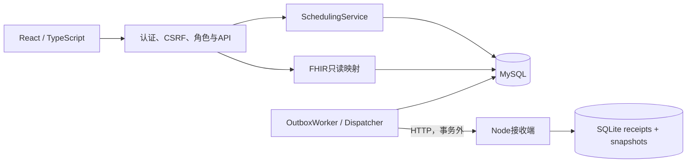
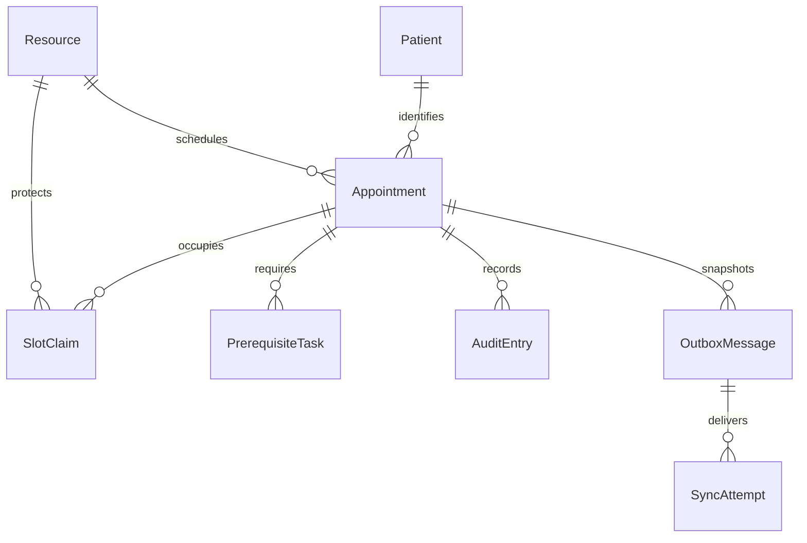
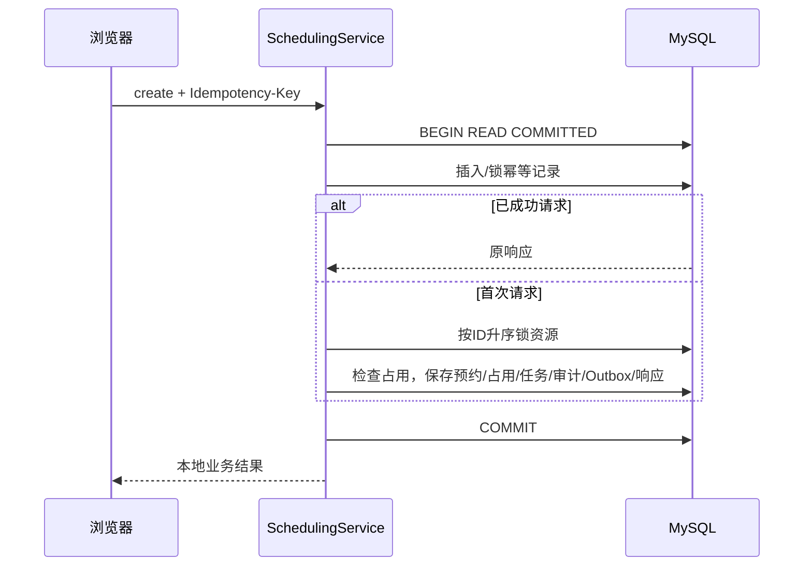
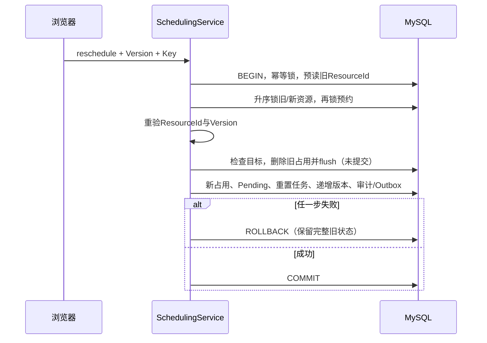
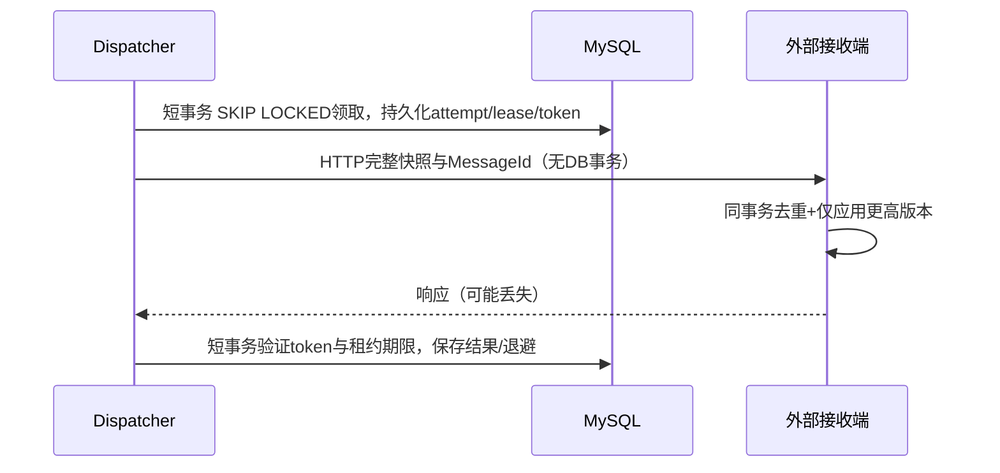

# 架构与数据模型

ClinicFlow是学习用途的模块化单体。一个ASP.NET Core进程承载API及HostedService；React从同源服务读取数据；MySQL是业务事实来源。独立Node/SQLite服务只模拟外部系统。模块通过明确业务服务协作，不为每个类机械创建接口。

边界：Identity.cs管理演示身份；Scheduling目录表达预约及事务；AuditEntry以同一事务追加；Integration目录管理外部投递；Fhir目录映射只读协议。ClinicDb统一映射与迁移是本单体的共享基础设施。外部HTTP用HttpClient、时间用TimeProvider、故障屏障用ITransactionProbe替换；正常运行只注册NoTransactionProbe。

图中Audit/Outbox关联是逻辑关联，模型中未全部设置数据库外键；预约不提供删除API。SlotClaim与Task有数据库外键，SlotClaim的复合主键是有效占用唯一约束。IdempotencyRecord按主体、操作和调用方键的SHA256主键定位，成功响应在业务事务内持久化，不自动清理。

SQL Server对照：可用UPDLOCK/HOLDLOCK等锁策略及唯一索引，但不能原样复制MySQL FOR UPDATE/SKIP LOCKED；SQL Server rowversion也不等于业务Version。双数据库运行未列入本项目实现。详细取舍见adr/001–004；未来扩大吞吐可将资源父锁细化，但必须重新验证所有改期和锁顺序。
