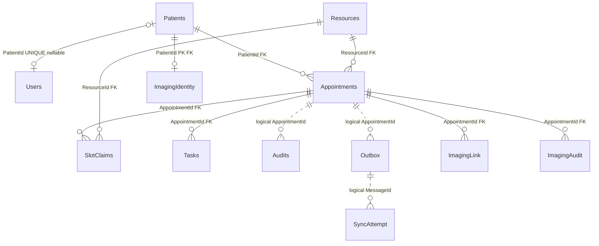

# 数据库表设计与数据字典

核对日期：2026-09-26。依据当前 [ClinicDb 映射](../backend/ClinicDb.cs)、[影像映射](../backend/Imaging/Models.cs)和[最新 EF 模型快照](../backend/Migrations/ClinicDbModelSnapshot.cs)整理。本文描述代码声明的结构，未查询本机数据库内容或重新执行迁移；目标实例实际版本需核对迁移记录。

## 1. 存储边界与表总览

MySQL 保存 **13 张业务表**，另由 EF 维护 `__EFMigrationsHistory`。外部 mock 接收端使用独立 SQLite；Orthanc 自主管理影像索引与文件；AI 会话使用单进程内存。四者不是同一个数据库事务。

| 分组 | 物理表名 | 职责 |
|---|---|---|
| 身份和目录 | Patients、Users、Resources | 档案、登录账号、可预约资源 |
| 预约 | Appointments、SlotClaims、Tasks | 预约事实、有效时段占用、前置核对 |
| 一致性与集成 | Idempotency、Audits、Outbox、SyncAttempt | 成功重放、业务审计、待发快照、投递流水 |
| 影像集成 | ImagingIdentity、ImagingLink、ImagingAudit | 身份映射、检查关联、独立审计 |

表名以 `ToTable` 为准：例如实体 PrerequisiteTask 对应 `Tasks`，SyncAttempt 和影像表是单数名称。字段类型采用 MySQL 映射；“非空”不等于“不可为空字符串”，业务校验另见服务层。以下未把 C# 属性初始值冒充 SQL DEFAULT；GUID、状态和时间的初值主要由应用写入。

## 2. 关系图

实线表示数据库外键，虚线表示仅逻辑引用。Idempotency 不含预约外键，靠请求身份及响应快照连接业务操作。

所有已声明外键均为 Restrict，不进行级联删除。ImagingLink.Source 与 ImagingIdentity.Source 没有数据库外键；外部患者身份一致性和 Study 归属由服务端核验。

## 3. 逐表字段、键与索引

### 3.1 Patients

预约归属档案。与登录账号分离，工作人员可以代档案创建预约；Identifier 是展示/接口用标识，当前没有唯一索引。

| 字段 | MySQL 类型 | 可空 | 含义 |
|---|---|---|---|
| `Id` | `int` | 否 | 主键；生成方式见本表键说明；自增 |
| `Identifier` | `longtext` | 否 | 档案标识 |
| `Name` | `longtext` | 否 | 显示名称 |

主键：`(Id)`。

索引（主键之外）：无。

数据库外键：无；逻辑关联见上述说明。

### 3.2 Resources

可预约资源目录，也是并发协议中的父行锁锚点；种子资源为预约室 A/B。

| 字段 | MySQL 类型 | 可空 | 含义 |
|---|---|---|---|
| `Id` | `int` | 否 | 主键；生成方式见本表键说明；自增 |
| `Kind` | `longtext` | 否 | 资源类型 |
| `Name` | `longtext` | 否 | 显示名称 |

主键：`(Id)`。

索引（主键之外）：无。

数据库外键：无；逻辑关联见上述说明。

### 3.3 Users

账号及单一角色。Id 是规范化账号名；注册时账号与 Patient 在同一事务创建。PatientId 可空供工作人员使用，唯一索引使一个档案至多绑定一个账号。

| 字段 | MySQL 类型 | 可空 | 含义 |
|---|---|---|---|
| `Id` | `varchar(255)` | 否 | 规范化用户名，应用限制3–40字符；列容量255 |
| `PasswordHash` | `longtext` | 否 | PasswordHasher 生成的密码散列 |
| `PatientId` | `int` | 是 | 所属本地患者档案 ID |
| `Role` | `longtext` | 否 | Scheduler / TaskOperator / Admin / Booker |

主键：`(Id)`。

索引（主键之外）：唯一 `(PatientId)`。

数据库外键：`PatientId → Patients.Id`（Restrict）。

### 3.4 Appointments

预约事实及当前状态。Pending/Confirmed/Cancelled/Completed 由业务服务校验；Version 是应用递增的 int 并发令牌，不是数据库自动 rowversion。

| 字段 | MySQL 类型 | 可空 | 含义 |
|---|---|---|---|
| `Id` | `varchar(36)` | 否 | 主键；生成方式见本表键说明 |
| `EndUtc` | `datetime(6)` | 否 | 预约结束 UTC，不占用此端点开始的槽 |
| `PatientId` | `int` | 否 | 所属本地患者档案 ID |
| `ResourceId` | `int` | 否 | 预约资源 ID |
| `StartUtc` | `datetime(6)` | 否 | 预约开始 UTC |
| `Status` | `varchar(20)` | 否 | Pending / Confirmed / Cancelled / Completed |
| `UpdatedUtc` | `datetime(6)` | 否 | 最近业务变更 UTC |
| `Version` | `int` | 否 | 预约业务版本 |

主键：`(Id)`。

索引（主键之外）：普通 `(PatientId)`；普通 `(ResourceId)`；普通 `(StartUtc, Id)`；普通 `(ResourceId, StartUtc, Id)`。

数据库外键：`PatientId → Patients.Id`（Restrict）；`ResourceId → Resources.Id`（Restrict）。

### 3.5 SlotClaims

有效占用投影，每行占用一个15分钟槽。复合主键阻止同一资源同一槽重复占用；Pending 即占位，取消或完成释放，占用不是永久历史。

| 字段 | MySQL 类型 | 可空 | 含义 |
|---|---|---|---|
| `ResourceId` | `int` | 否 | 预约资源 ID |
| `SlotStartUtc` | `datetime(6)` | 否 | 15分钟槽开始 UTC |
| `AppointmentId` | `varchar(36)` | 否 | 关联预约 ID |

主键：`(ResourceId, SlotStartUtc)`。

索引（主键之外）：普通 `(AppointmentId)`。

数据库外键：`AppointmentId → Appointments.Id`（Restrict）；`ResourceId → Resources.Id`（Restrict）。

### 3.6 Tasks

预约前置核对项。创建时生成两项，确认前必须全部完成；改期重置完成信息。当前没有 (AppointmentId,Name) 唯一约束。

| 字段 | MySQL 类型 | 可空 | 含义 |
|---|---|---|---|
| `Id` | `int` | 否 | 主键；生成方式见本表键说明；自增 |
| `AppointmentId` | `varchar(36)` | 否 | 关联预约 ID |
| `Completed` | `tinyint(1)` | 否 | 该核对项是否完成 |
| `CompletedBy` | `longtext` | 是 | 完成人账号；未完成时为空 |
| `CompletedUtc` | `datetime(6)` | 是 | 完成 UTC；未完成时为空 |
| `Name` | `longtext` | 否 | 显示名称 |

主键：`(Id)`。

索引（主键之外）：普通 `(AppointmentId)`。

数据库外键：`AppointmentId → Appointments.Id`（Restrict）。

### 3.7 Idempotency

请求去重与成功结果回放。Id 为 actor、operation、调用方 key 的 JSON 序列 SHA256；Fingerprint 为规范化业务 payload 的 SHA256。没有独立 Actor/Key/AppointmentId 列。

| 字段 | MySQL 类型 | 可空 | 含义 |
|---|---|---|---|
| `Id` | `varchar(64)` | 否 | 主体、操作、调用方键组合的 SHA256 |
| `CreatedUtc` | `datetime(6)` | 否 | 幂等记录创建 UTC |
| `Fingerprint` | `varchar(64)` | 否 | 规范化请求内容的 SHA256 十六进制串 |
| `Response` | `longtext` | 是 | 成功响应 JSON 文本；事务初始阶段可为空 |

主键：`(Id)`。

索引（主键之外）：无。

数据库外键：无；逻辑关联见上述说明。

### 3.8 Audits

追加预约操作历史，与对应业务变更同事务保存。AppointmentId 是逻辑引用，当前没有预约外键；保留操作、版本及请求关联标识。

| 字段 | MySQL 类型 | 可空 | 含义 |
|---|---|---|---|
| `Id` | `bigint` | 否 | 主键；生成方式见本表键说明；自增 |
| `Action` | `longtext` | 否 | 操作名称 |
| `Actor` | `longtext` | 否 | 执行人账号标识 |
| `AppointmentId` | `varchar(255)` | 否 | 关联预约 ID |
| `AtUtc` | `datetime(6)` | 否 | 记录 UTC |
| `CorrelationId` | `longtext` | 否 | 请求/投递关联标识 |
| `Summary` | `longtext` | 否 | 操作摘要 |
| `Version` | `int` | 否 | 预约业务版本 |

主键：`(Id)`。

索引（主键之外）：普通 `(AppointmentId, Id)`。

数据库外键：无；逻辑关联见上述说明。

### 3.9 Outbox

与业务事务原子写入的待投递快照。预约状态和投递状态分开；AppointmentId 是逻辑引用，不是数据库外键。

| 字段 | MySQL 类型 | 可空 | 含义 |
|---|---|---|---|
| `Id` | `varchar(36)` | 否 | 主键；生成方式见本表键说明 |
| `AppointmentId` | `longtext` | 否 | 关联预约 ID |
| `Attempts` | `int` | 否 | 投递尝试计数 |
| `CorrelationId` | `longtext` | 否 | 请求/投递关联标识 |
| `LastError` | `longtext` | 是 | 最近失败原因 |
| `LeaseToken` | `longtext` | 是 | 本次领取的归属令牌 |
| `LeaseUntilUtc` | `datetime(6)` | 是 | 领取租约到期 UTC |
| `NextAttemptUtc` | `datetime(6)` | 否 | 下一次可领取时间 UTC |
| `Payload` | `longtext` | 否 | 完整快照 JSON 文本，数据库列不是 JSON 类型 |
| `Status` | `varchar(20)` | 否 | Pending / Processing / Delivered / Failed |
| `Version` | `int` | 否 | 预约业务版本 |

主键：`(Id)`。

索引（主键之外）：普通 `(Status, NextAttemptUtc)`。

数据库外键：无；逻辑关联见上述说明。

### 3.10 SyncAttempt

每次领取投递产生的尝试流水，记录租约归属和结果。MessageId 逻辑关联 Outbox.Id，当前没有数据库外键。人工重试保留已有尝试历史。

| 字段 | MySQL 类型 | 可空 | 含义 |
|---|---|---|---|
| `Id` | `bigint` | 否 | 主键；生成方式见本表键说明；自增 |
| `AtUtc` | `datetime(6)` | 否 | 记录 UTC |
| `LeaseToken` | `varchar(36)` | 否 | 本次领取的归属令牌 |
| `MessageId` | `varchar(36)` | 否 | 对应 Outbox 消息 ID |
| `Outcome` | `longtext` | 否 | 尝试结果，初始为 Started |

主键：`(Id)`。

索引（主键之外）：唯一 `(LeaseToken)`；普通 `(MessageId, Id)`。

数据库外键：无；逻辑关联见上述说明。

### 3.11 ImagingIdentity

本地 Patient 到一个外部影像身份的映射。当前 PatientId 为主键，意味着每个患者只有一条映射，尚不支持一个患者多来源多身份。

| 字段 | MySQL 类型 | 可空 | 含义 |
|---|---|---|---|
| `PatientId` | `int` | 否 | 所属本地患者档案 ID |
| `ExternalPatientId` | `varchar(64)` | 否 | 外部 DICOM PatientID；utf8mb4_bin 比较 |
| `Issuer` | `varchar(64)` | 否 | 外部 IssuerOfPatientID；utf8mb4_bin 比较 |
| `Source` | `varchar(40)` | 否 | 外部影像来源标识 |

主键：`(PatientId)`。

索引（主键之外）：唯一 `(Source, ExternalPatientId, Issuer)`。

数据库外键：`PatientId → Patients.Id`（Restrict）。

### 3.12 ImagingLink

预约与既有 Study 的关联，不保存像素。主键为预约和 Study UID，支持多检查关联和并发去重；Source 不是主键组成部分。

| 字段 | MySQL 类型 | 可空 | 含义 |
|---|---|---|---|
| `AppointmentId` | `varchar(36)` | 否 | 关联预约 ID |
| `StudyInstanceUid` | `varchar(64)` | 否 | DICOM Study Instance UID |
| `Description` | `varchar(256)` | 否 | 关联时保存的检查描述 |
| `LinkedBy` | `varchar(100)` | 否 | 关联操作账号 |
| `LinkedUtc` | `datetime(6)` | 否 | 关联 UTC |
| `Source` | `varchar(40)` | 否 | 外部影像来源标识 |

主键：`(AppointmentId, StudyInstanceUid)`。

索引（主键之外）：无。

数据库外键：`AppointmentId → Appointments.Id`（Restrict）。

### 3.13 ImagingAudit

影像关联/解除的独立追加审计；与本地关系修改同事务写入，有预约外键。解除不删除外部文件、不修改预约 Version，也不新增预约 Outbox。

| 字段 | MySQL 类型 | 可空 | 含义 |
|---|---|---|---|
| `Id` | `bigint` | 否 | 主键；生成方式见本表键说明；自增 |
| `Action` | `longtext` | 否 | 操作名称 |
| `Actor` | `longtext` | 否 | 执行人账号标识 |
| `AppointmentId` | `varchar(36)` | 否 | 关联预约 ID |
| `AtUtc` | `datetime(6)` | 否 | 记录 UTC |
| `CorrelationId` | `longtext` | 否 | 请求/投递关联标识 |
| `StudyInstanceUid` | `varchar(64)` | 否 | DICOM Study Instance UID |

主键：`(Id)`。

索引（主键之外）：普通 `(AppointmentId, Id)`。

数据库外键：`AppointmentId → Appointments.Id`（Restrict）。

## 4. 为什么这样拆表

| 设计 | 解决的问题 | 保证所在层 |
|---|---|---|
| Users 与 Patients 分离 | 账号不等于预约归属；工作人员代建仍归患者 | 可空唯一 PatientId、外键及 AppointmentAccess |
| Appointments 与 SlotClaims 分离 | 历史预约可保留，而有效占用可释放；区间冲突转成离散槽唯一性 | `(ResourceId, SlotStartUtc)` 主键 + 资源父行锁 |
| Version 与 Idempotency 分离 | 旧决策冲突与同一命令重放是两种问题 | EF 并发令牌/版本重验；请求哈希主键及指纹 |
| Audits 与 Outbox 同事务追加 | 本地成功后必须有历史和待发事件，避免提交成功但无待发记录 | SchedulingService.Execute 的显式事务 |
| Outbox 与 SyncAttempt 分离 | 一个消息可以多次尝试；重试不抹掉过去的投递记录 | 持久租约、唯一 LeaseToken、结果回写校验 |
| ImagingLink 与预约状态分离 | 历史 Study 可用于多次就诊；关联不代表创建检查订单 | 独立复合主键、影像审计事务，不动预约 Version |
| JSON 快照用 longtext | 保留原响应与发送内容 | 应用序列化/验证；当前无数据库 JSON Schema 约束 |

预约列表索引 `(StartUtc,Id)` 支持按时间稳定排序；`(ResourceId,StartUtc,Id)` 支持资源筛选后的时间范围/排序。单列 ResourceId 索引被显式保留，避免升级时误删外键依赖索引。Outbox 的 `(Status,NextAttemptUtc)` 服务领取查询；它不是租约归属校验的替代品。当前没有针对所有过滤组合的索引，也没有声明 Patient.Identifier 唯一性。

## 5. 一次业务操作涉及哪些表

| 操作 | 同一 MySQL 事务内 | 事务外 / 限制 |
|---|---|---|
| 注册 | Patients + Users | 注册不是预约幂等协议；响应丢失可用已注册账号登录 |
| 创建 | Idempotency、Appointments、SlotClaims、Tasks、Audits、Outbox | 先有序锁 Resources；HTTP 投递在提交之后 |
| 改期 | 同上，删除旧占用后 flush、建立新占用并重置 Tasks | flush 不是 commit，后续失败整体回滚 |
| 完成前置任务 / 确认 | Tasks 或 Appointments、版本、Idempotency、Audits、Outbox | 权限和合法前置状态由应用服务检查 |
| 取消 / 完成 | 预约终态、释放 SlotClaims、版本、Idempotency、Audits、Outbox | Completed 还要求 Confirmed 且结束时间已到 |
| 领取 / 完成投递 | Outbox + SyncAttempt 的短事务 | 中间 HTTP 无数据库事务；完成时校验 token 和到期时间 |
| 关联 / 解除影像 | ImagingLink + ImagingAudit | 外部身份核验先于关联写入；解除不依赖远端删除 |

预约事务采用 ReadCommitted。资源按 ID 全序加锁，改期锁后重验资源和版本；唯一槽位约束作为最后防线。状态合法性、15分钟对齐、最长4小时、结束后完成及患者访问范围主要由应用代码约束，当前未建立对应 CHECK/ENUM 约束。详细时序见[架构](architecture.md)。

## 6. AI 预约的数据设计与持久化边界

**目前没有 AgentSession、Candidate、聊天消息等 MySQL 表。** [AgentSessions](../backend/Agent/AgentSessions.cs) 使用单进程 Dictionary 保存状态；容量128，会话固定30分钟过期，同会话用 SemaphoreSlim 串行处理。

| 内存字段 | 用途 |
|---|---|
| Id / Owner / PatientScope / Expires | 会话标识、账号归属、Booker 固定患者范围、期限 |
| History / Turns | 对话上下文与轮次限制 |
| Constraints / RequiredResourceId | 已核验查询条件与明确资源约束 |
| Candidates | 服务端保存完整 Booking 的候选；不是模型自由输出的可写记录 |
| ConfirmingId / Appointment / ConfirmReplies | 锁定确认对象、成功预约快照与同候选响应重放 |

AI 只拥有 `list_catalog` / `search_slots` 两个只读工具；Availability 从实际 SlotClaims 计算连续空位，查询不占位。模型生成解释和调用工具，不能直接写 SQL 或创建预约。

用户点击候选后只提交 CandidateId，后端取回保存的 Booking，以稳定幂等键调用原有 SchedulingService。成功写入的仍是上节预约表、审计、Outbox 和 Idempotency，未另建一套“AI 预约表”。时段已被抢占则用原约束重新查询，并要求用户再次确认；不自动换时段下单。

SSE 文字增量和工具进度不是数据库提交结果；完整 result 才能启用候选。确认结果未知时重试同一候选；重启/过期后内存状态丢失，已有数据库预约与幂等记录保留，用户先查预约列表再开启新会话。跨进程恢复和多实例会话存储属于未来设计，不是已实现功能。完整链路见[Agent 指南](appointment-agent.md)。

## 7. 接收端 SQLite 与 Orthanc

接收端表定义见 [server.mjs](../mock-external/server.mjs)，开启 WAL：

| 表 | 字段与声明 | 职责 |
|---|---|---|
| receipts | message_id TEXT PRIMARY KEY；appointment_id TEXT NOT NULL；version INTEGER NOT NULL | 按消息 ID 持久去重 |
| snapshots | appointment_id TEXT PRIMARY KEY；version INTEGER NOT NULL；payload TEXT NOT NULL | 每预约当前已接收快照 |

在同一 `BEGIN IMMEDIATE` 事务内插 receipt，仅在未重复且传入版本更高时更新 snapshot。重复或旧版本不会覆盖较新状态。SQLite 与 MySQL 没有跨库外键、分布式事务或 exactly-once 保证。

Orthanc 的内部索引和影像文件属于独立归档存储，ClinicFlow 只保存来源、身份和 Study UID 等引用。MySQL 备份不含影像像素，解除关联不删除 Orthanc 文件，恢复业务数据库不等于完成影像灾备。

## 8. 迁移顺序与维护

| 顺序 | 迁移 | 主要变化 |
|---|---|---|
| 1 | InitialCatalog | 患者与资源目录 |
| 2 | DemoIdentity | 登录账号 |
| 3 | AtomicScheduling | 预约、占用、任务、幂等、审计和 Outbox |
| 4 | SyncAttempts | 投递流水、租约令牌唯一索引及消息历史索引 |
| 5 | ResourceScheduleIndex | 增加资源/开始时间/ID 索引 |
| 6 | RegisteredAccounts | 用户 PatientId 绑定、唯一索引与外键 |
| 7 | ImagingLinks | 三张影像集成表与演示身份映射 |

迁移文件见 [Migrations](../backend/Migrations/)。按部署目标核查 `__EFMigrationsHistory`；应用启动迁移仅面向单实例演示。升级与实际备份恢复记录见[验收文档](acceptance.md#upgrade)。

目前没有审计/幂等/接收凭据的自动保留清理、软删除体系、影像跨来源主键设计或 Agent 持久化。扩展这些能力时需同时修改模型、迁移、事务/授权测试与本文，不应仅在文档中先声明已支持。
