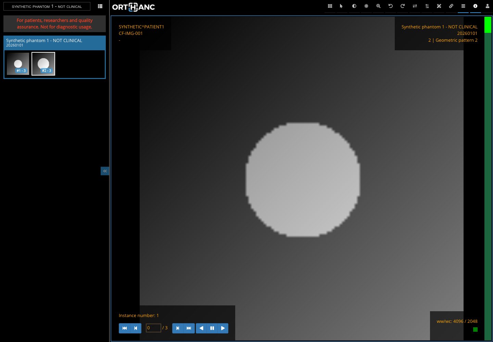
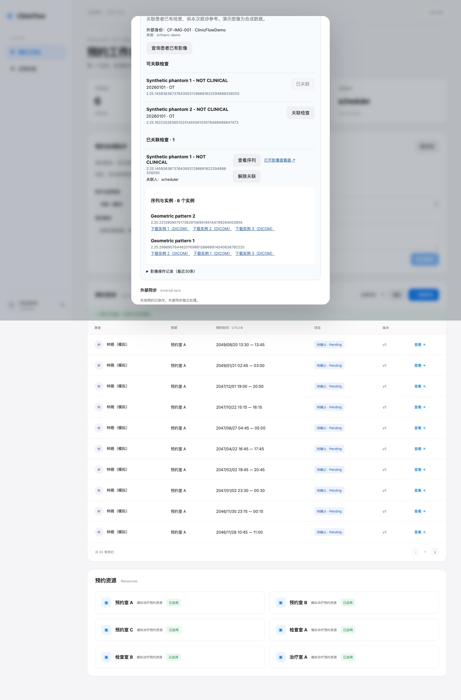

# 就诊前影像资料关联

本模块支持工作人员把患者已有的影像检查关联到门诊预约。预约不是检查申请，关联不意味着本次预约产生了该影像。使用合成几何图案，无真实患者数据。

当前实现与测试见[验证记录](verification.md)，实现边界见[设计文档](design.md)。

## 环境启动

在仓库根目录执行 `./scripts/imaging-up.sh`。需要 Docker、Python 3 和首次安装依赖的网络。脚本只启动影像服务，不清空现有数据库。再次运行将导入相同 UID 的数据。

- Orthanc 镜像固定为 `orthancteam/orthanc:26.7.0`，开启 DICOMweb 和 Stone Web Viewer。
- HTTP 管理端口仅绑定回环地址 8042，启用 Basic 认证；用户名 `clinicflow`，密码取本地 `.env` 的 `INTEGRATION_TOKEN`，不提供给前端。
- 不开放 DIMSE 端口。本模块实现 HTTP DICOMweb 集成。
- 数据保存到独立 Docker 卷 `imaging-data`；文件和 UID 清单生成到被 Git 忽略的 `artifacts/dicom-fixtures/`。
- 患者 1：`ClinicFlowDemo / CF-IMG-001`，两项检查；患者 2：`ClinicFlowDemo / CF-IMG-002`，一项检查。每项检查两个序列，每序列三个实例。
- 数据是 Secondary Capture、Explicit VR Little Endian、单帧 16 位灰度，不是 CT 扫描，也不能用作诊断。

## 标准与组件来源

- [DICOM PS3.18 Web Services](https://dicom.nema.org/medical/dicom/current/output/html/part18.html)：查询、获取、存储的标准语义。
- [DICOM PS3.10 文件格式](https://dicom.nema.org/medical/dicom/current/output/html/part10.html)：Part 10 文件封装。
- [Orthanc DICOMweb 插件](https://orthanc.uclouvain.be/book/plugins/dicomweb.html)：实际对接服务端。
- [Orthanc Docker 配置](https://orthanc.uclouvain.be/book/users/docker-orthancteam.html)：容器配置。
- [Stone 查看器](https://orthanc.uclouvain.be/book/plugins/stone-webviewer.html)：复用的影像显示组件。
- [pydicom 文件生成](https://pydicom.github.io/pydicom/stable/auto_examples/input_output/plot_write_dicom.html)：测试文件生成库。

标准接口与 Orthanc 私有 API 必须分清：fixture 通过 STOW-RS 导入；查看器静态资源来自 Orthanc 插件，它们本身不是 DICOM 协议。

## 学习顺序

1. [DICOM 从零学习与两周路线](learning-guide.md)：标签、标识、层级、三类 Web 服务与 .NET 实践。
2. [设计与代码导读](design.md)：业务边界、事务、授权、错误与标准支持范围。
3. [运行与排障](README.md#operations)：启动、分层测试、受控停机、两项真实协议互通问题。
4. [面试材料](../demo-and-interview.md#imaging-interview)：三分钟演示、英文介绍、追问、STAR 与岗位要求映射。
5. [实际验证记录](verification.md)：验收证据和没有验证的范围。

## 实际运行截图





<a id="operations"></a>

## 运行、验证与排障手册

所有命令在仓库根目录执行。保留现有 `.env`；不要为了运行影像模块重新生成账号密码，也不要执行 `docker compose down -v` 清空业务数据。

### 启动与演示

```bash
./scripts/imaging-up.sh
docker compose --profile full --profile imaging up -d --build --wait app
```

macOS 本机 Python 若报证书链错误，可使用系统 CA：

```bash
PIP_CERT=/etc/ssl/cert.pem ./scripts/imaging-up.sh
```

浏览器打开 `http://127.0.0.1:5080`，用 scheduler 或 taskoperator 演示账号登录，密码来自自己已有的本地配置。Scheduler 为种子患者林晓创建预约，打开详情里的“就诊前影像资料”，依次查询、关联、查看序列、打开查看器。患者 1 有两个候选检查；患者 2 有一个。注册账号没有影像权限，也不会自动绑定演示影像。

查看器默认可加载一个序列。可在左侧选择序列、切换实例、调整窗宽窗位。界面标明合成数据；文件下载返回原始 `.dcm` 对象。解除关联不会删除 Orthanc 中的数据。

首次拉取 Orthanc 镜像较大，需预留网络和磁盘空间。重复导入使用相同 UID；不要把“未报错”当成真实医院数据去重策略已经完整实现。

#### 本机开发

```bash
./scripts/api.sh
npm --prefix frontend run dev
```

默认 API 5080、前端 5173。若 5080 上已有容器，请先决定采用容器入口还是本机入口。Vite 支持 `API_PROXY_TARGET` 环境变量用于连接独立验证端口，例如 `API_PROXY_TARGET=http://127.0.0.1:5081 npm --prefix frontend run dev -- --port 5174`。

### 分层验证

```bash
./scripts/test.sh --no-restore
```

后端测试只允许 `*_tests` 数据库，会重建测试库，不应把 TEST_DB 指向业务库。

以下 HTTP/浏览器测试会在本地演示业务库创建虚构预约和测试账号；不会清空已有业务。测试对象时间位于未来，使用随机时间减少冲突。

```bash
set -a
source .env
set +a
node tests/http-imaging.mjs
node tests/http-imaging-outage.mjs
npm --prefix frontend run test:e2e -- imaging.spec.ts
```

浏览器测试默认前端 5173；直接测试容器时加 `BASE_URL=http://127.0.0.1:5080`。本机未安装 Playwright 浏览器时，执行 `cd frontend && npx playwright install chromium`，或在已有 Chrome 的机器上指定 `PW_CHANNEL=chrome`。HTTP 测试可用 `API_URL` 指定 API 地址。

故障脚本会短暂停止本项目 Orthanc 容器，并在 `finally` 中恢复。不要在他人正在演示时运行。若脚本或终端被强行终止，恢复命令为 `docker compose --profile imaging up -d --wait orthanc`。

CI 已接入影像服务、数据导入、HTTP 集成、故障脚本和浏览器测试。工作流文件存在不等于远端 CI 已通过；影像交付阶段仅做本地提交，实际证据见 [验证记录](verification.md)。

### RCA 1：查询成功却没有可关联检查

**现象**：HTTP 返回 200，但应用候选列表为空。源服务中确实有该患者的两项 Study。

**定位过程**：

1. 确认不是认证失败或服务不可用；检查 HTTP 状态和错误码。
2. 直接检查受控测试数据的 QIDO 响应标签，不查看真实患者信息。
3. 比较后端 `Matches` 使用的 `00100020` 与 `00100021`。
4. 当前 Orthanc 版本的 `includefield=all` 响应没有我们需要的 `00100021`，并非文件中不存在该值。
5. 显式请求 `includefield=00100021` 后，QIDO 返回正确的签发机构。

**修复**：显式请求 IssuerOfPatientID 和 StudyDescription；保留严格身份校验，不通过忽略 Issuer 来“修好列表”。关联和读取时仍然获取完整元数据逐实例验证。

**回归**：真实服务 HTTP 测试要求患者 1 只获得自己的两项检查；患者 2 的 UID 直接提交仍被拒绝。结论只针对实际测试版本，不应推断所有服务端 `includefield=all` 行为都一样。

### RCA 2：查看器打开，但图像未加载/缩略图报错

**现象**：静态 HTML、JavaScript 和 WebAssembly 加载正常，DICOMweb 请求返回 403；或主图能显示，缩略图失败。

**定位过程**：查看器成功打开只证明静态页面可达。浏览器 Network 显示 Stone 使用 `0020000D` 标签编号查询，调用全局 `/series`、`/instances` 以及序列 `/rendered` 端点。初版应用代理只允许关键字查询和部分嵌套路径。

**修复**：为实际需要的标准 GET 路由增加白名单，按应用路径中的 Study UID 限制范围；全局查询必须显式携带相同 Study UID，不能透传任意查询。实例查询限定到当前 Study 下的指定 Series。静态资源和像素请求仍需有效 Cookie、员工角色、关联关系和患者核验。

**回归**：Playwright 捕获真实像素请求、检查画布和截图，同时断言查看器请求无 HTTP 4xx/5xx；HTTP 测试尝试跨 Study 访问并要求 403。单独检查首页返回 200 不足以覆盖这个问题。

### RCA 3：影像服务停止

**注入**：`docker compose --profile imaging stop orthanc`。

**预期**：查询和元数据读取返回 503 `imaging_unavailable`，包含 correlationId；已有本地关系仍可查看，解除关联可成功并留下审计。恢复后再次查询成功。

**排查顺序**：先保存界面请求标识；查应用日志对应的错误码和状态；检查 Orthanc 容器健康状态；检查应用 BaseUrl 是宿主回环还是 Compose 服务名；检查凭据配置。不要将服务器认证失败误报为“患者没有影像”，不要把密码粘贴到日志或面试材料。

**设计解释**：预约和影像分属两个系统，影像不可用不应破坏已经提交的预约。这个版本选择明确失败、由用户重试；没有声称实现影像缓存、熔断、离线阅片或无限重试。

### 常见问题

| 现象 | 优先检查 |
|---|---|
| 401 / 403 | 是否登录、是否 Scheduler/TaskOperator；Admin 不自动拥有影像权限 |
| `imaging_identity_missing` | 是否使用新注册患者；只有两个演示患者有映射 |
| `imaging_identity_mismatch` | PatientID、Issuer、来源、整项检查是否混入其他身份 |
| 关联后显示 409 duplicate | 刷新确认已有关系；重复请求不是新增关系 |
| 解除后旧查看器失败 | 正常授权行为，服务器不再允许继续读取；已缓存内容无法收回 |
| 文件能下载但不能读 | 确认保存的是解包后的 DICOM，不是完整 multipart 文本 |
| 响应超过 64 MiB | 当前实现有明确上限，真实大检查需流式、分页及性能设计 |
| 新版本容器仍无影像入口 | 重新构建 app，确认访问的端口与运行版本一致 |

### 迁移与恢复

`ImagingLinks` 迁移只增加 ImagingIdentity、ImagingLink、ImagingAudit 与演示映射。应用启动沿用现有 `MigrateAsync`。SQLite 影像索引/文件在独立卷，MySQL 备份不包含像素文件；不能把仅恢复 MySQL 说成完整影像恢复。

常规重启保留两个存储。若将来回滚该迁移，会删除影像关联与审计，因此应该先备份并明确数据保留策略。本次没有自动执行破坏性回滚。
