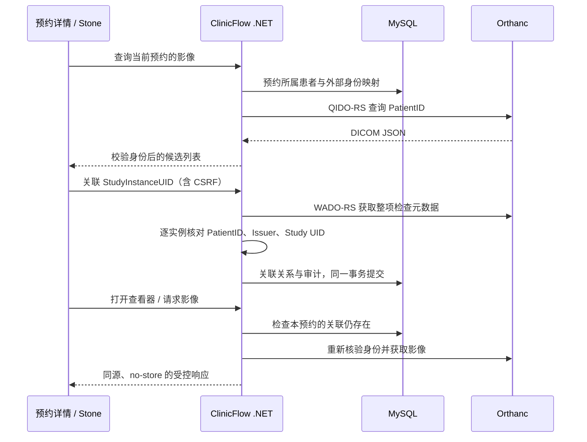

# 设计与 .NET 代码导读

## 用例与边界

工作人员为预约关联患者已有检查。一次预约可关联多项 Study；一项 Study 可供同一患者的多个预约参考。没有新增检查申请、设备工作列表或报告签署流程。不会修改原预约状态、Version、占用时段及 Outbox 消息。

## 模块入口

- `backend/Imaging/Models.cs`：EF 实体和映射。理解实体≠标准资源：ImagingLink 是业务关系，DICOM Study 是外部影像检查。
- `DicomWebClient.cs`：HttpClient 与标准表示转换。UID 校验、QIDO 查询、WADO 元数据、失败映射、内存/时间边界。
- `ImagingService.cs`：业务规则。先查预约所属患者，再查身份映射，不接受前端指定的 PatientID。关联前及读取时逐实例校验。
- `Endpoints.cs`：角色策略、HTTP 路由、CSRF 配合、DICOM multipart 解包、受限的查看器代理。
- `ClinicDb.cs` / `Migrations/*ImagingLinks*`：新增三张表和两个演示身份映射；不重建业务表。
- `tests/ImagingTests.cs`：真实 MySQL 约束/事务测试及 HTTP 适配器测试。
- `tests/http-imaging.mjs`：真实 Orthanc 的标准接口与应用鉴权测试。

## 数据模型和不变量

| 表 | 关键字段/约束 | 目的 |
|---|---|---|
| ImagingIdentity | PatientId 主键；Source + ExternalPatientId + Issuer 唯一 | 第一阶段每个内部患者只映射一个影像来源；姓名不作为身份键 |
| ImagingLink | AppointmentId + StudyInstanceUid 复合主键 | 数据库抵挡重复点击及并发关联；保留来源、描述和关联人 |
| ImagingAudit | 追加 Linked/Unlinked、actor、时间、请求标识 | 解除关系后仍可解释谁在何时操作 |

`Source=orthanc-demo` 标识我们配置的影像服务端；`Issuer=ClinicFlowDemo` 是 DICOM PatientID 的签发机构，两者语义不同。标识用严格字符串匹配。真实系统需要考虑标识迁移、跨机构匹配、Issuer 的更完整结构；本阶段没有自动匹配姓名、生日，也没有身份冲突处理 UI。

新增注册用户没有预置影像映射，界面明确提示缺失。映射由受控种子数据提供，没有向普通用户开放修改接口。

## 事务与并发

关联先进行网络校验，再调用一次 `SaveChangesAsync`，由 EF 把 Link 和 Audit 一起保存。网络请求不放入长数据库事务。重复键 MySQL 1062 映射为 409 `imaging_duplicate`；审计插入也回滚。

解除关联使用本地事务：条件 DELETE + 审计 INSERT。即使 Orthanc 不可用，也能解除错误关联。两个并发解除操作只有一个删除成功，失败者不会写成功审计。

这不是跨系统分布式事务。Orthanc 可能在校验后被修改，所以每次读取重新校验；已经返回到浏览器的数据无法通过解除关联收回。关联写请求响应丢失后再次提交会得到 409，客户端刷新确认；这里没有照搬预约的幂等响应回放机制。

## 权限边界

`imaging` 策略仅允许 Scheduler / TaskOperator。Admin 不自动拥有临床影像权限，Booker 和匿名账号不能查询、关联、下载或打开查看器。第一阶段工作人员的范围与现有项目一致，没有新增院区或诊疗团队细粒度授权。

查看器的每个静态资源和 DICOMweb 请求都经过应用认证、关联检查及身份核验。代理仅支持白名单 GET 路由，不透传客户端凭据，也不开放 Orthanc 的管理 REST API。服务器连接凭据从环境变量读取；不在查看器链接中放 token。

本机 8042 是维护者使用的回环管理端口且要求 Basic 认证；浏览器业务入口走 ClinicFlow。部署到共享环境需按实际网络边界关闭管理映射、启用 HTTPS，并使用独立影像凭据。

## 错误与可观察性

| code | HTTP | 用户处理 |
|---|---|---|
| imaging_identity_missing | 409 | 配置外部身份映射 |
| imaging_identity_mismatch | 409 | 停止关联/访问并核查标识，不放宽校验 |
| imaging_duplicate | 409 | 刷新关联列表 |
| imaging_not_linked | 404 | 刷新详情，检查是否已经解除 |
| imaging_not_found | 404 | 核实影像是否存在 |
| imaging_unavailable | 503 | 检查服务、凭据和连接，稍后重试 |
| imaging_invalid_response | 502 | 检查标准响应格式 |
| imaging_too_large | 502 | 演示响应超过 64 MiB，需设计流式/分页扩展 |

错误响应和页面显示 correlationId；服务端不记录凭据或患者元数据。外部错误记录类型/HTTP 状态。请求超时为请求头阶段 10 秒、响应体阶段 20 秒；不自动重试交互请求，防止用户等待时间不可控。

## 标准支持声明（项目级，非认证）

实现为 DICOMweb **客户端和受限代理**，服务端由 Orthanc 提供。支持按 PatientID 的 QIDO Study 搜索、WADO Study 元数据、实例原文件下载以及查看器所需的序列/实例/帧读取。导入脚本通过 STOW-RS 写入合成测试文件，ClinicFlow 不向业务用户暴露上传接口。

仅验证了随项目生成的 Secondary Capture / Explicit VR Little Endian / 单帧灰度对象。不能据此宣称支持所有厂商、模态、压缩语法、多帧、视频、SR、RT 或完整 DICOM 一致性。未实现 DIMSE、MWL、MPPS、Storage Commitment。

既有 FHIR R4 Patient/Appointment 保留原范围；没有增加 ImagingStudy、ServiceRequest、DiagnosticReport，也没有把自定义 Outbox 消息称作 HL7 消息。
